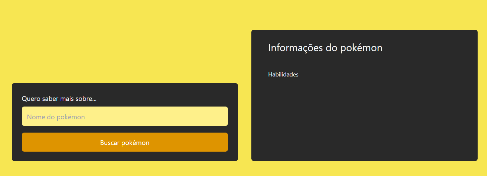
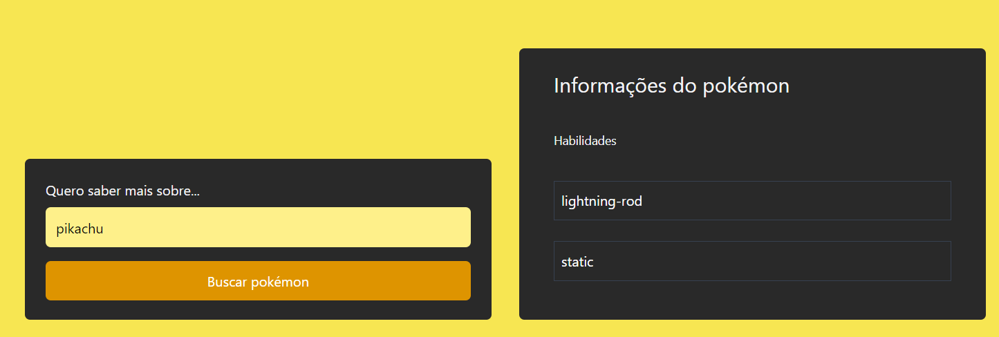
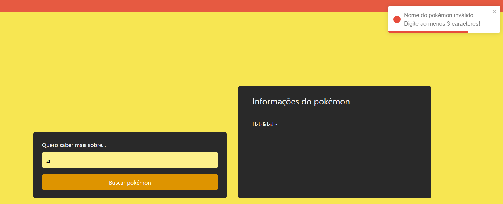
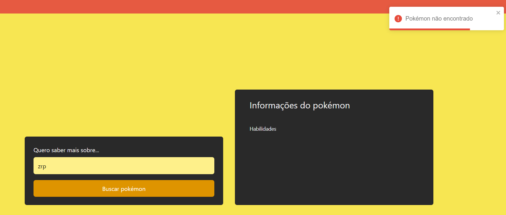

# Documentação

## Objetivo
- Desenvolver uma aplicação que funcione como um `middleware` da pokéApi que deve retornar as habilidade do pokémon buscado ordenadas em ordem alfabética.

## Tecnologias utilizadas

- Node, Next, Jest, supertest, zod, Redis, Docker e toastify

## Rodando a aplicação

- Faça o clone do repositório.
- É possível Dockerizar o `backend`, para isso, entre na pasta `backend` e execute o comando `docker build -t zrpteste/dockernode .`. Após isso execute `docker run -p 3333:3333 -d zrpteste/dockernode`
- Entre na pasta `frontend` e execute um `npm i` e depois `npm run dev`
- Nesse ponto deve ser possível acessar a aplicação no endereço `http://localhost:3000/` e fazer as requisições

Obs: As primeiras requisições via web estão falhando, então não desista rs

## Backend

### GET POKEMON

** ROTA
- `http://localhost:3333/api/pokemons/pokemon_name`
- `pokemon_name` deve ser substituído pelo nome do pokémon ao qual deseja buscar
- Ex: `http://localhost:3333/api/pokemons/pikachu`


### Retorno esperado
** STATUS 200 OK
```json
[
	{
		"ability": {
			"name": "lightning-rod",
			"url": "https://pokeapi.co/api/v2/ability/31/"
		},
		"is_hidden": true,
		"slot": 3
	},
	{
		"ability": {
			"name": "static",
			"url": "https://pokeapi.co/api/v2/ability/9/"
		},
		"is_hidden": false,
		"slot": 1
	}
]
```


### ERRORS
** STATUS 400 BAD REQUEST
- Caso seja enviado um nome com menos de 3 caracteres
- Ex: `http://localhost:3333/api/pokemons/zr`

```json
{
	"error": {
		"message": "Nome do pokémon inválido. Digite ao menos 3 caracteres.",
		"statusCode": 400,
		"errorLocationCode": "backend_src_middleware_validateAndTransformPokemonName.middleware.ts"
	}
}
```

** STATUS 404 NOT FOUND
- Caso seja enviado um nome de pokémon que não existe
- Ex: `http://localhost:3333/api/pokemons/zrp`

```json
{
	"error": {
		"message": "Pokémon não encontrado",
		"statusCode": 404,
		"errorLocationCode": "backend_src_services_getPokemon.service.ts"
	}
}
```


## TESTES

- Testes foram construídos utilizando `jest`. Para executar os testes, acesse a pasta `backend` e execute o comando `npm test`.
### Retorno esperado
```
$ npm test

> backend@1.0.0 test
> jest

 PASS  src/tests/app.spec.ts
  Test the main API route using pikachu
    √ Should return pokemon data successfully (279 ms)                                                                                              
    √ Should return Pokemon with ability 'lightning-rod' (42 ms)                                                                                    
    √ Should return Pokemon with ability 'static' (43 ms)                                                                                           
  Test the main API route using a non exist pokemon name                                                                                            
    √ Should return 404 for invalid Pokemon name (2099 ms)                                                                                          
  sortAlphabetically function                                                                                                                       
    √ Should sort Pokemon abilities alphabetically (1 ms)                                                                                           
                                                                                                                                                    
Test Suites: 1 passed, 1 total                                                                                                                      
Tests:       5 passed, 5 total
Snapshots:   0 total
Time:        5.016 s
Ran all test suites.
```

## CACHE

- Utilizei `Redis` e `upstash.com` para fazer cache dos pokémons já buscados.
- Adicionei alguns `console.log` no `service` para demonstrar uma vez que não é possível que seja feito o acesso na minha conta no upstash para verificar o cache. Qualquer dúvida podemos fazer uma call para demonstração.

## Frontend

- Para buscar um pokémon, basta digitar o nome no campo e clicar em buscar;

## Retorno Esperado

- Antes:


- Depois:



### ERRORS

- Caso seja digitado um nome menor que 3 caracteres:


- Caso seja digitado um pokémon que não existe:



